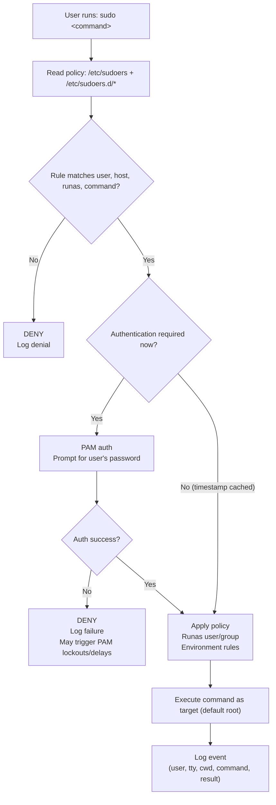

## 1) What are `su` and `sudo`?

- **`su`** (“switch user”) starts a new shell (or runs a command) as another user, commonly **root**.
- **`sudo`** (“superuser do”) runs **one command** (or an interactive root shell) with elevated privileges **according to policy** in `/etc/sudoers` (and `/etc/sudoers.d/*`).

For RHCSA: prefer **`sudo`** for controlled elevation and auditing.

---

## 2) How do they work (high level)?

### `su` (switch user)
- Runs `su` and requests authentication (via PAM).
- If accepted, the process changes identity to the target user (UID/GID) and starts a shell.

Typical usage:
```bash
su            # switch to root (asks for root password)
su - alice    # switch to user alice with a "login" shell
su -c 'id'    # run a single command as target user
```

### `sudo` (policy-based elevation)
- `sudo` checks **authorization** (sudoers rules) and may require **authentication** (your password).
- If allowed, it runs the command as the target user (default: root) and logs the action.

Typical usage:
```bash
sudo dnf install -y vim
sudo systemctl restart sshd
sudo -i        # interactive root login-style shell
```

---

## 3) When do they exist / work? (`sudo` is a separate package)

- On many systems, **`sudo` may not be installed by default** (minimal installs/containers). It is typically provided by the `sudo` package.
- **`su` is usually present** because it comes from base system utilities (commonly `util-linux` on RHEL-like systems).

Quick checks:
```bash
command -v sudo || echo "sudo not installed"
command -v su

rpm -q sudo 2>/dev/null || true
rpm -q util-linux 2>/dev/null || true
```

Also note: even if installed, `sudo` works only if you are permitted by sudoers (often via the **wheel** group on RHEL).

---

## 4) How `/etc/sudoers` works

Sudoers is a policy file. Conceptually:
- “Who” (user/group)
- “Where” (host)
- “As whom” (Runas)
- “What commands” (command list)
- Optional flags (NOPASSWD, env handling, etc.)

A common rule shape:
```text
USER  HOST=(RUNAS)  COMMANDS
```

Always edit with **`visudo`**:
```bash
visudo
visudo -f /etc/sudoers.d/rhcsa
```

Mermaid overview of `sudo` decision flow:



---

## 5) Why does `su` sometimes *not* ask for the root password?

`su` asks for the **target user’s password** (often root) **unless** the caller is already privileged.

Example:
```bash
sudo su
```

Here, `sudo` starts `su` **as root** (effective UID 0). From `su`’s perspective, the caller is already root, so **there is nothing to authenticate**. Result: **no root password prompt**.

---

## 6) `sudo -i` vs `sudo su -` (are they the same?)

They are *similar in intent*: both typically drop you into a **root login-style shell**.

- **`sudo -i`**: `sudo` directly creates an interactive “login-like” root shell.
- **`sudo su -`**: `sudo` runs `su -`, which then creates a root login shell.

Key practical difference (important for operations/auditing):
- With `sudo -i`, you are clearly in a `sudo`-initiated session.
- With `sudo su -`, sudo often logs only that you ran `su -`; commands typed *after* that are not individually logged by sudo.

For RHCSA-style best practice: prefer **`sudo -i`** when you truly need an interactive root environment.

---

## 7) What is the `-` in `su -` (and what if you don’t use it)?

`-` means **login shell** (same idea as `--login`).

### `su -` (login shell)
- Changes to the target user’s home directory (e.g., `/root`).
- Sets up environment closer to a real login.
- Reads typical “login” profile scripts (system + user).

### `su` (no `-`)
- Often keeps more of your current environment and current working directory.
- You may end up as root **in your current directory**, with a mixed environment.

Why it matters:
- Reduces confusion: root should typically work from `/root` with root’s environment.
- Avoids “environment surprises” (PATH, HOME, proxies, locale, custom variables).

A quick demo:
```bash
pwd; echo "$HOME"; whoami
sudo su
pwd; echo "$HOME"; whoami
exit
sudo su -
pwd; echo "$HOME"; whoami
```

---

## 8) Exiting: `exit` or `Ctrl+D`

To leave the root shell (or any subshell):
- Type:
```bash
exit
```
- Or press **Ctrl + D** (sends EOF to the shell)

Both return you to the parent shell.

---

## 9) What happens if you repeat commands and create “shells inside shells”?

Every time you start a new interactive shell (`su`, `su -`, `sudo -i`), you typically create a **child shell** (a subshell). If you do it again, you get another layer.

Example of accidental nesting:
```bash
sudo -i
sudo -i
sudo -i
```

Now you must `exit` **three times** to get back.

How to *see* nesting:
```bash
echo "$SHLVL"              # shell level (often increases with nesting)
ps -p $$ -o pid,ppid,cmd   # current shell PID and parent
```

What if you type the wrong password “several times”?
- `sudo` will deny access and log failures.
- Depending on PAM policy (e.g., `pam_faillock`), repeated failures can introduce delays or temporary lockouts.
- This is configuration-dependent; do not assume a fixed number of attempts.

---

## 10) Practical guidance for an RHCSA student

- Prefer **single-command sudo**:
  ```bash
  sudo systemctl status sshd
  sudo dnf install -y tree
  ```
- If you need many root actions, use **`sudo -i`** (cleaner intent than `sudo su`):
  ```bash
  sudo -i
  ```
- Use `su` mainly when:
  - sudo is not installed / not configured, or
  - you are practicing systems where root passwords are used by policy.
- Remember: `sudo su` (and especially `sudo su -`) can reduce per-command sudo auditing after you enter the root shell.

